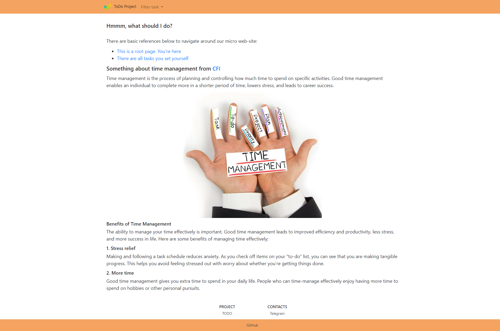
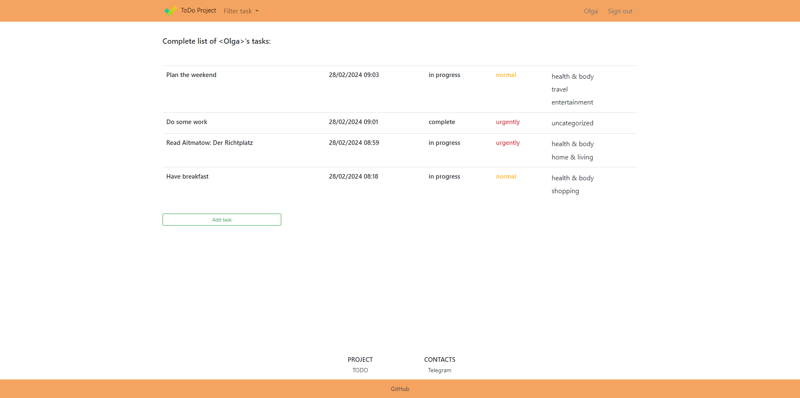
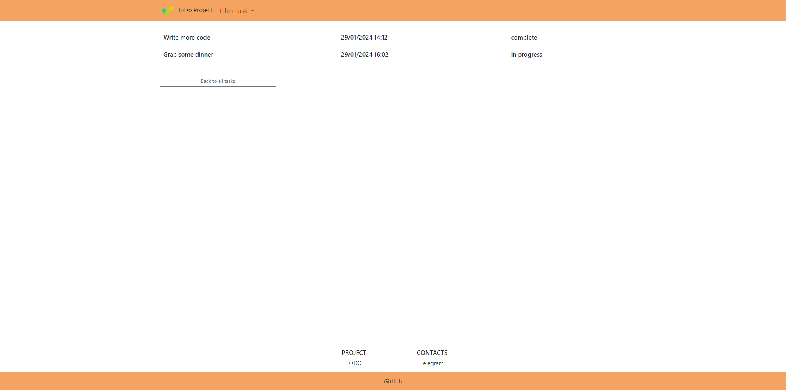
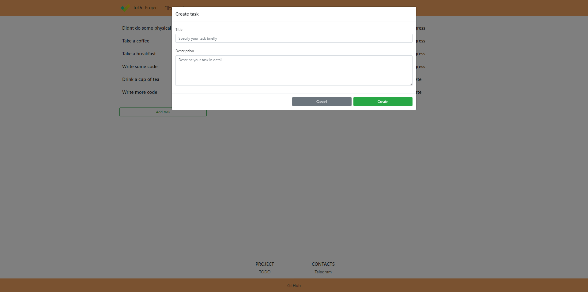
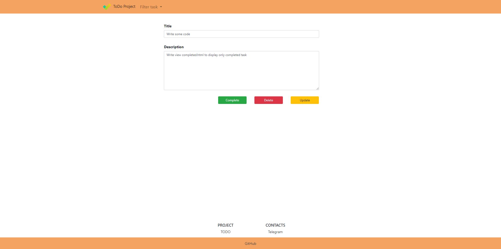

# Project "TODO"

About project
-------------
This is a classic TODO web application with basic functionality:

- add task
- update task (in progress -> complete)
- delete task
- display only completed tasks/only new tasks/all tasks

Tech stack.
--------------
- Java 17
- PostgreSQL 14
- Spring Boot 2
- Hibernate 5
- Thymeleaf
- Bootstrap
- Liquibase
- Lombok

Environment requirements.
------------------------
1. Java 17
2. Maven 3.8
3. PostgreSQL 14

Launching the project.
---------------------
1. Recommended Chrome based browser.
2. Install PostgreSQL: login - postgres, password - password;
3. Create cinema database;
> CREATE DATABASE todo;
4. Build the project and run the Spring Boot application
> mvn clean package spring-boot:run

Application Interaction.
------------------------
------------------------
Main
----

List of all tasks
--------

Filter to choose task type
-------

All completed tasks
------------

All new tasks
-----------

Create task
----------

Edit task
----------

Contacts.
--------
- Telegram - https://t.me/ConstaMezenin.